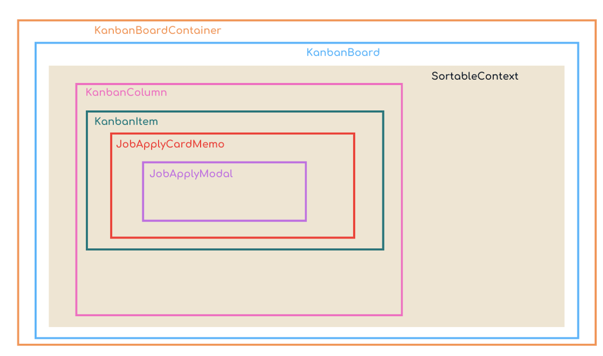

Le dossier recruitment contient :
- layout.tsx : responsable de la mise en page commune et de la vérification de l'authentification pour toutes les pages du recrutement.

- page.tsx : gère l'affichage et la gestion des candidatures via un tableau Kanban.

## Le kanban 
`page.tsx` à la racine de /recruitment utilise plusieurs composants contenus dans /components/kanbanCandidates.

Il utilise la bibliothèque `dnd kit` pour les fonctionnalités de drag-and-drop.Voici le lien vers la [documentation officielle](https://dndkit.com/) de la librairie.

### La gestion des jobs
`useList` est utilisé pour récupérer la liste des jobs depuis Strapi et les trie par date de création.
Un composant de sélection `Select` de la bibliothèque Ant Design permet à l'utilisateur de choisir un job parmi la liste de jobs récupérés.
La valeur sélectionnée est `selectedJobId` qui est une variable d'état contenant l'ID du job actuellement sélectionné.
A chaque fois que la sélection change, la fonction `handleJobChange` est appelée. Elle met à jour l'ID du job sélectionné (selectedJobId), le titre du job (selectedJobTitle) ainsi que l'url de la page.

### La gestion des étapes du process de recrutement
Une interface `step` définit la structure des étapes de recrutement.
La liste des étapes de recrutement est récupéré avec `useList` de la collection `JobApplyStep` dans strapi. Ces étapes sont triés dans l'ordre croissant par le champ "order". **L'ajout d'une nouvelle étape de candidature se fait donc dans Strapi en veillant à bien modifier l'ordre des étapes.**

### La gestion des candidatures

### KanbanBoardContainer
C'est le conteneur principal. Il gère le défilement horizontal pour pouvoir afficher les différentes colonnes du kanban. Le composant rend les children (tous les éléments qu'il contient) à l'intérieur de la zone de défilement horizontale.

### Kanbanboard 
C'est le composant qui contient les fonctionnalités de Drag-and-drop. Pour cela, il importe la librairie dnd kit qui est une boite à outil permettant de transformer des composants en éléments et en zones déplaçables. 
Le composant `KanbanBoard` est une fonction qui accepte des propriétés :
- onDragEnd : une fonction appelée lorsque le drag-and-drop se termine.
- children: les éléments enfants à rendre à l'intérieur du Kanban.
Des capteurs de souris `MouseSensor` et de toucher `TouchSensor` sont configurés pour activer le drag-and-drop après que l'utilisateur ait déplacé l'élément d'une distance de 5 pixels. 

La fonction `handleDragEnd` est appelée lorsque l'événement de drag-and-drop se termine. Si l'élément n'est pas placé sur une cible valide (event.over === null), la fonction se termine prématurément. Sinon, elle appelle la fonction 'onDragEnd' passée en tant que prop.

Le composant retourne une structure `div` imbriquée avec des styles pour créer la mise en page du tableau Kanban: 
- Le conteneur principal (div) a un affichage en colonne pour permettre au `div` interne d'occuper toute la hauteur disponible.
- Le conteneur interne (div) est configuré pour permettre le défilement horizontal et vertical et utilise le contexte DndContext fourni par la librairie dnd kit,  pour gérer le drag-and-drop.

### SortableContext
Le composant fourni par la librairie dnd kit gère le tri et la gestion des éléments au sein du kanban. Il permet de générer l'interface interactive du kanban.
Il accepte deux propriétés : 
- `items`: la liste des éléments à trier. Il s'agit ici d'un tableau de candidature (tableau des job apply des personnes qui ont liké le job, ou la tableau des job apply des personnes qui ont postulé au job, ou encore le tabelau des job apply des candidatures dans le process de recrutement )
- `strategy`: la stratégie de tri. La stratégie choisie ici est `verticalListSortingStrategy` qui permet d'organiser les éléments verticalement.

